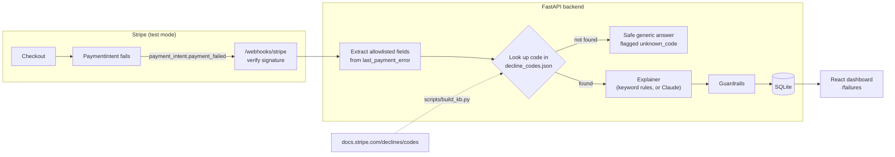

# Decline Decoder

[](https://github.com/almira-halkina/decline-decoder/actions/workflows/ci.yml)

**Plain-language explanations for failed Stripe payments, grounded in Stripe's own docs.**

When a card payment fails, Stripe returns a code like `card_velocity_exceeded` or
`do_not_honor`. Decline Decoder turns each failure into what a merchant actually needs: a
two-sentence explanation, the next step, whether a retry can help, and a polite message to
send the customer. Every answer is built from Stripe's official
[decline-code documentation](https://docs.stripe.com/declines/codes). The app never invents a
reason, never shows a different code than Stripe returned, and never tells a customer their card
was flagged for fraud.

**Live demo:** _add your Render URL here_ · runs in Stripe **test mode** only.

<!-- Record a ~30 s GIF: store → Pay → decline card → dashboard. Save as docs/demo.gif. -->


---

## How it works



1. **Knowledge base.** `scripts/build_kb.py` downloads Stripe's decline-code page and saves all
   50 card codes to [`backend/data/decline_codes.json`](backend/data/decline_codes.json), with
   each code's description and next steps copied word for word. Only two fields are derived
   (whether to hide the reason from the customer, and whether a retry can help), and the script
   documents the rule behind each.
2. **Lookup in code.** The backend finds the entry by `decline_code`, falling back to the error
   `code`, because Stripe sets only `code` for some failures. The explainer only ever sees that
   one entry.
3. **Explainer.** By default, ordered keyword rules over the docs text pick the category and
   next step, and every answer lists the rule that fired. Setting `EXPLAINER_ENGINE=claude`
   switches to Claude with a validated structured-output schema; the rules stay as the fallback.
4. **Guardrails** check every answer, whichever engine wrote it (see below).

## Results

From `evals/run_evals.py` on the 32-case [golden set](evals/golden.jsonl), 3 runs each
([full report](evals/results.md)). CI fails if any number gets worse.

| Metric | Rules engine |
| --- | --- |
| Category accuracy | 100% |
| Recommended-action accuracy | 100% |
| `retry_safe` accuracy | 100% |
| Hallucinated codes | 0 |
| Fraud reason leaked to customer | 0 |
| Consistency across 3 runs | 100% |
| `/explain` latency p50 / p95 | 7.1 ms / 9.0 ms (in-process; the explainer itself takes under 1 ms) |

A 100% score from the rules engine shows it works as specified; it isn't an independent
benchmark. I wrote the expected labels by hand from Stripe's docs (each case quotes its source
sentence), and the rules were designed against the same docs. The golden set is what any other
engine, such as Claude, has to match.

### Checked against the real Stripe API

`scripts/simulate_failures.py` creates real failing PaymentIntents with Stripe's
[test cards](https://docs.stripe.com/testing#declined-payments) and compares each result with
the docs. Run on 2026-10-07:

| Test card | `code` / `decline_code` returned | Docs say |
| --- | --- | --- |
| Generic, insufficient funds, lost, stolen, velocity, fraudulent | as documented | ✅ match |
| Expired card, incorrect CVC, processing error | `decline_code` **is also set** (equal to `code`) | "n/a" |
| Radar "always blocked" | `card_declined` / `fraudulent` | not stated |
| 3D Secure card charged off-session | `authentication_required` / `authentication_required` | not stated |
| Decline after attaching | `card_declined` / `generic_decline` | not stated |

All 12 webhooks arrived, passed signature verification and were stored once each.

## Design decisions and trade-offs

**The code looks up the docs entry, not the model.** If a model chose the entry itself, it
could pick the wrong one or mix up similar codes such as `lost_card` and `pickup_card`. A
dictionary lookup can't get this wrong, so the model only has to explain the single entry it's
given. Codes that aren't in the knowledge base never reach an explainer; they get a fixed safe
answer flagged `unknown_code`.

**Structured output, validated twice.** Category and action are fixed lists (enums), so the
dashboard can filter on them and the evals can score them exactly. With Claude, the schema is
enforced by structured outputs and checked again by Pydantic. A free-text answer could be
neither filtered nor scored.

**The customer never learns a fraud reason.** For `fraudulent`, `lost_card`, `stolen_card` and
`merchant_blacklist`, Stripe says: *"present it in the same manner as `generic_decline`"*. This
project applies the same rule to `pickup_card` and `restricted_card`, because their docs
description says the card may have been reported lost or stolen. The guardrails replace the
customer message with a fixed generic one in code, and replace any customer message containing
fraud wording, so this holds however the explanation was written.

**Guardrails run on every answer:**
- `source_code` must equal the input code.
- No other decline code may appear in the text.
- The merchant explanation is capped at 2 sentences.
- Concealed codes never get `retry_safe=true`.
- Stripe's runtime `advice_code=do_not_try_again` beats the code's general advice.

Every correction is recorded in `flags`, and the evals count them.

**Rules engine first, LLM optional.** Every decline code has fixed docs text, so keyword rules
already label the categories correctly, run in under a millisecond, cost nothing and give the
same answer every time. An LLM would add a personalised explanation, not better labels. Both
engines share the same lookup, guardrails and golden set, so switching engines is a measured
change, not a rewrite.

**Privacy by allowlist.** Only nine fields are taken from `last_payment_error`: decline code,
error code, message, advice code, payment-method type, card brand, card country, amount and
currency. The request model rejects any other field with a 422, and messages are scrubbed for
card numbers and emails. A test scans the database to check that no buyer email, name, last4 or
payment-method ID is ever stored. `advice_code` is used by the guardrails but is never sent to
an LLM.

**What `retry_safe` means.** It is `true` only when retrying the same payment with the same
details can reasonably succeed, such as `processing_error` or `issuer_not_available`. A wrong
CVC can be fixed, but it is `false` because the customer has to change something first.

**Different-provider judge (not built yet).** The plan was an LLM-as-judge for explanation
clarity, using a different model provider to avoid self-preference bias. I left it out because
the default engine doesn't use an LLM, so the deterministic metrics are the meaningful ones for
now.

## Run it locally

You'll need Python 3.12, [uv](https://docs.astral.sh/uv/), Node 20+, a Stripe account in test
mode and the [Stripe CLI](https://docs.stripe.com/stripe-cli).

```bash
cp .env.example .env            # add sk_test_ / pk_test_ keys from the Stripe Dashboard
uv sync --project backend
cd frontend && npm install && cd ..
```

Run each of these in its own terminal:

```bash
cd backend && uv run uvicorn app.main:app --reload --port 8000
```
```bash
stripe listen --events payment_intent.payment_failed --forward-to localhost:8000/webhooks/stripe
```
```bash
cd frontend && npm run dev     # http://localhost:5173
```

Put the `whsec_...` secret that `stripe listen` prints into `.env` as `STRIPE_WEBHOOK_SECRET`.
Then pay on the store page with a decline test card, or fill the dashboard in one go:

```bash
uv run --project backend python scripts/simulate_failures.py
```

To run the checks:

```bash
cd backend && uv run pytest && uv run ruff check . ../scripts ../evals && uv run mypy app tests ../scripts ../evals
uv run --project backend python evals/run_evals.py --check
```

## Project layout

```
backend/app/
  kb.py            knowledge-base lookup (decline_code, then code)
  rules.py         keyword-rules explainer (default)
  explainer.py     engine selection; Claude structured-output explainer
  guardrails.py    checks applied to every answer, plus safe fallbacks
  sanitize.py      the only payload an LLM may see
  stripe_events.py allowlisted extraction from payment_intent.payment_failed
  repository.py    SQLite storage, idempotent by Stripe event id
  main.py          /explain, /checkout, /webhooks/stripe, /failures
backend/data/decline_codes.json   built by scripts/build_kb.py
scripts/           build_kb.py, simulate_failures.py
evals/             golden.jsonl, run_evals.py, thresholds.json, results.md
frontend/src/      store page and merchant dashboard (React + TypeScript)
render.yaml        Render blueprint (API on Docker + static dashboard)
```

## What I'd build next

- **Radar signals.** Pull `outcome.risk_level` and the Radar rule that fired, so merchants can
  tell an issuer decline apart from their own Radar rule.
- **Retry scheduling.** For `retry_safe` declines, schedule retries the way Stripe's
  [Smart Retries](https://docs.stripe.com/invoicing/automatic-collection#smart-retries) do,
  respecting Stripe's limit of 8 retries per charge.
- **Multilingual customer messages,** using the card's country as a hint.
- **Claude engine evals.** Run the golden set with `--engine claude`, compare it with the rules
  baseline, and add the different-provider clarity judge.
- **Persistent storage.** Render's free tier resets SQLite on every restart; Postgres would keep
  the history.

## Built with Claude Code

<!-- Edit this section in your own words: say what you decided, what you checked yourself, and what you'd do differently. -->

I built this with [Claude Code](https://claude.com/claude-code) as a pair programmer. It read
Stripe's docs before writing any code, wrote the code in small commits, and ran the tests,
evals and live Stripe simulations as it went.

What was checked against reality rather than trusted:

- **The knowledge base** is rebuilt from the live English docs page; the rebuild changes only
  the timestamp.
- **Every test-card code** was triggered in my Stripe test account, and the returned codes were
  compared with the docs. That's how the undocumented Radar and 3DS results above were found.
- **Webhook signature verification** is tested with real HMAC signatures, including tampered,
  stale and replayed events.
- **The fraud-concealment rule** was checked against Stripe's wording for each code.
- **Two bugs found by tests:** the card-number scrubber swallowed a trailing space, and Stripe's
  own text for `authentication_not_handled` names a different code, which tripped the
  hallucination guardrail.
